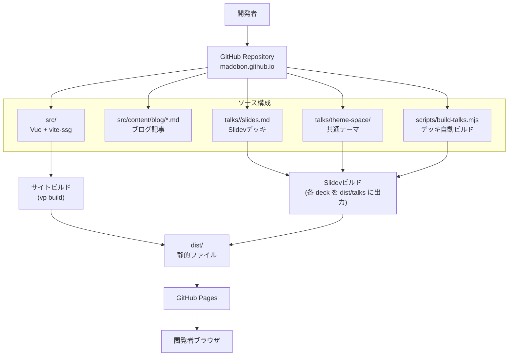

# Mermaidで当システム構成図をまとめる

このサイトは「ホームページ本体（Vue + vite-ssg）」と「Slidev製の登壇資料群」を同じリポジトリで管理し、最終的に GitHub Pages へ静的配信しています。

文章だけだと追いづらいので、今回は Mermaid で全体構成を図としてまとめました。

## システム全体図

## 図の見どころ

- `src/` 配下は通常のサイト本文（Home / About / Blog / Talks 一覧など）を担当
- `src/content/blog/*.md` は frontmatter 付き Markdown 記事として読み込まれ、ブログ一覧と詳細ページへ反映
- `talks/<slug>/` の各 deck は Slidev で個別ビルドされ、`dist/talks/<slug>/` に配置
- `scripts/build-talks.mjs` が deck の検出とビルドをまとめて実行
- 最終的に `dist/` 以下を GitHub Pages で配信

> 補足: このリポジトリでは通常 `vp` コマンドを優先して使います。環境都合で `vp` が利用できない場合のみ、互換的に `pnpm run build` などを利用します。

## 運用メモ

今回のように構成を図にしておくと、次の判断がしやすくなります。

1. どの変更が「サイト本体」に影響するか
2. どの変更が「登壇資料の配信」に影響するか
3. CI で分離すべきジョブ（サイト build / talks build）の境界

今後はこの図をベースに、CI の分割やキャッシュ設計も整理していく予定です。
