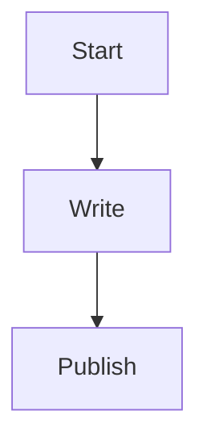
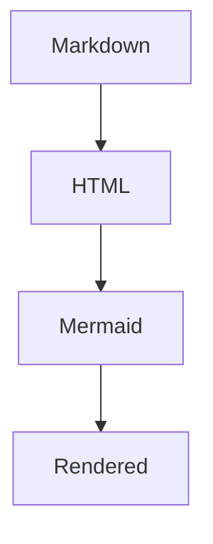

# ブログの自前 Markdown parser を markdown-it に寄せた

このサイトのブログは、最初はかなり小さな自前 Markdown parser で動かしていました。

見出し、リスト、コードフェンス、インラインのリンクや太字くらいなら十分だったのですが、`mermaid` を入れたくなった時点で、さすがに少し無理が出てきました。

## もともとの状態

`src/data/blog.ts` では、frontmatter を自前で切り出して、そのあと本文も自前の関数で HTML にしていました。

この方式は単純で追いやすい反面、Markdown の仕様を少しずつ足していくたびに、自分で面倒を見る範囲が増えていきます。

特に今回ほしかったのは、次のようなコードフェンスを自然に扱えることでした。

```md


Mermaid そのものの描画はクライアント側でやるとしても、少なくとも Markdown 側で `mermaid` fence を素直に受け止められる土台がほしくなりました。

## 今回やったこと

本文の変換は `markdown-it` に寄せて、frontmatter だけは軽い実装を残す形にしました。

`markdown-it` の `fence` renderer を差し替えて、`info` が `mermaid` のときだけ専用の HTML を返すようにしています。

```ts
markdown.renderer.rules.fence = (tokens, index, options, _env, self) => {
  const token = tokens[index]
  const info = token.info.trim().split(/\s+/)[0]

  if (info === 'mermaid') {
    return `<div class="mermaid">${markdown.utils.escapeHtml(token.content)}</div>`
  }

  return defaultFenceRenderer(tokens, index, options, _env, self)
}
```

そのうえで記事詳細ページ側で `mermaid.run()` を呼んで、描画を後から差し込む形にしました。

実際にいまは、記事本文の中でこんなふうに書ける状態です。



## gray-matter をやめた理由

最初は frontmatter も `gray-matter` に置き換えようとしました。

ただ、このサイトでは `src/data/blog.ts` がブラウザ側のアプリ起動にも巻き込まれる構成なので、Node 寄りの `gray-matter` をそのまま import すると、開発サーバーではページが開かなくなりました。

サーバー自体は `200 OK` を返しているのに、ブラウザではページが出てこない、という少し嫌な壊れ方をしました。

この挙動を見て、今回は次の折衷案にしました。

1. 本文の Markdown 変換は `markdown-it`
2. frontmatter は軽いローカル実装のまま維持
3. Mermaid の描画だけ記事ページでクライアント実行

結果として、拡張しやすさはかなり上がりつつ、今の構成も壊さずに済みました。

## いまの感想

最初から全部 third-party に寄せるより、どこがブラウザで読まれて、どこが build-time 専用かをちゃんと意識して選ぶほうが大事だと実感しました。

今回の形なら、今後 `mermaid` を入れやすくなりますし、Markdown の細かい表現も少しずつ増やしていきやすそうです。
